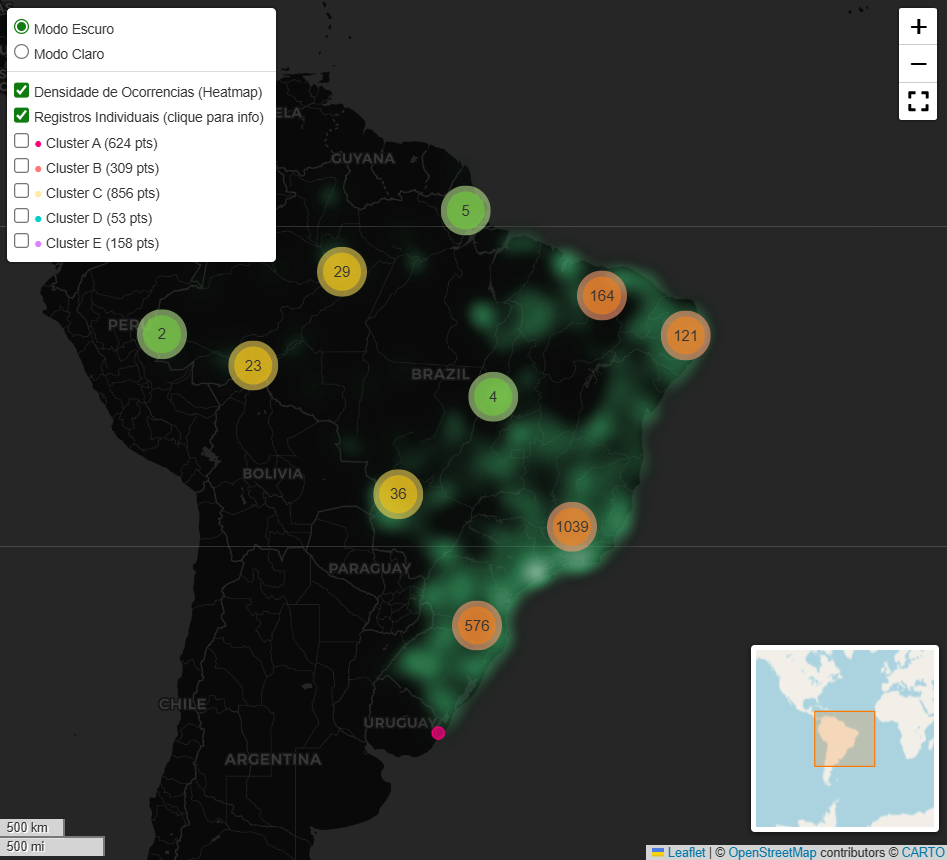

[](README.md)
[](README.br.md)

# Plants of Brazil

A Data Engineering and Data Science pipeline focused on biodiversity records of Brazilian flora. This project was created as a way to apply data engineering, exploratory data analysis, and machine learning concepts in a real-world scenario. Rather than working with tutorial datasets, I wanted to explore a topic that genuinely interests me using public data and create visualizations that anyone could interact with and understand.

The data comes from the [GBIF](https://www.gbif.org/) *(Global Biodiversity Information Facility)*, one of the world's largest biodiversity databases, containing billions of species occurrence records contributed by research institutions, scientists, and citizen science initiatives.
 
### Pipeline Structure

```
Plantas-do-Brasil/
├── pipeline.ipynb      # data collection, cleaning, and storage
├── analise.ipynb              # EDA + Clustering K-Means
├── geovisualizacao.ipynb      # interactive Folium map
├── dados/
│   ├── plantas_brasil.parquet  
│   └── plantas_brasil.csv   
├── extra/ 
│   ├── BR_UF_2025 
│   └── images.png  
└── mapa_plantas_brasil.html    
```

# Project Stages

**Stage 1 - Data Engineering:** `pipeline.ipynb`

Collects records of native Brazilian plants through the GBIF REST API, cleans the data, and stores it in optimized formats for analysis. What happens in this stage:

- Paginated API requests (300 records per page) with error handling and rate limiting;
- Selection and renaming of relevant columns;
- Removal of records without coordinates, text normalization, and spatial validation within Brazilian territory;
- Removal of duplicate records based on `gbifID`;
- Storage in `.parquet` and `.csv`.

**Stage 2 - EDA + Machine Learning:** `analise.ipynb`

Exploratory analysis of the collected data and geographic clustering using K-Means. What happens in this stage:

- Top 10 species with the highest number of records;
- Top 10 states with the highest number of records; 
- Distribution by source type.

K-Means applied to group geographic coordinates into regions with similar biodiversity profiles. What happens in this stage:

- Elbow Method and Silhouette Score to determine the optimal value of K;
- Latitude/longitude scatter plot colored by cluster;
- Most common species, top state, and centroid identified for each cluster.

**Etapa 3 - Interactive Map:** `geovisualizacao.ipynb`  

Interactive map built with [Folium](https://python-visualization.github.io/folium/) (a Python wrapper for Leaflet.js).

- Heatmap: visualization of record density across Brazil;
- Interactive markers: up to 2,000 individual points with detailed pop-ups;
- Clusters A–E: independent toggle control for each K-Means cluster;
- MiniMap: overview map for easier navigation;
- Fullscreen mode: expand the map to occupy the entire screen.

Each marker displays information about the species, botanical family, state, municipality, year of observation, and assigned cluster.

# Examples

- Top 10 Species by Number of Records:


- Choosing K for K-Means:


- Map Generated with Folium:



<br>

# Running the Project

1. Clone the repository

```bash
git clone https://github.com/seu-usuario/Plantas-do-Brasil.git
cd Plantas-do-Brasil
```

2. Install the dependencies

```bash
pip install -r requirements.txt
```

3. Run the notebooks

Open Jupyter Notebook and execute the notebooks in the following order:

```
pipeline.ipynb 
analise.ipynb
geovisualizacao.ipynb
```

# Technologies Used

- `requests`: GBIF REST API integration.
- `pandas` and `pyarrow`: data processing and storage.
- `matplotlib` and `seaborn`: exploratory analysis and visualizations.
- `scikit-learn`: geographic clustering with K-Means.
- `folium`: interactive map creation.


